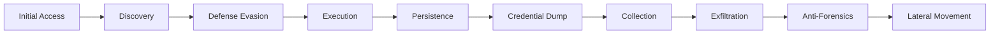

# SOC Incident Investigation – Azuki Import/Export Compromise

**Analyst:** Steven Cruz  
**Source:** Cyber Range SOC Challenge  
**System:** AZUKI-SL (IT Admin Workstation)

---

## Overview
Azuki Import/Export Trading Co. suffered a targeted compromise leading to theft of supplier contracts and pricing data.  
The attacker used stolen credentials for RDP access, staged malware, dumped credentials, exfiltrated data using a cloud service, and attempted cover-up.

---

## Key Findings

### Initial Access
- Vector: RDP (Valid Account)
- Source IP: 88.97.178.12
- Compromised User: `kenji.sato`

### Discovery
- Network enumeration using: `ARP.EXE -a`

### Defense Evasion
- Staging directory: `C:\ProgramData\WindowsCache`
- Defender exclusions: 3 file extensions  
- Defender excluded folder: `C:\Users\KENJI~1.SAT\AppData\Local\Temp`
- LOLBin used: `certutil.exe`

### Persistence
- Scheduled Task: `Windows Update Check`
- Task payload: `C:\ProgramData\WindowsCache\svchost.exe`
- Backdoor account created: `support`

### Credential Access
- Dump tool: `mm.exe`
- Module: `sekurlsa::logonpasswords`

### Collection & Exfiltration
- Archive: `export-data.zip`
- Exfiltration service: Discord
- C2 IP / Port: `78.141.196.6:443`

### Anti-Forensics
- First event log cleared: `Security`

### Lateral Movement Attempt
- Target IP: `10.1.0.188`
- Tool used: `mstsc.exe`

---

## MITRE ATT&CK Mapping

| Stage | Technique | ID |
|------|-----------|----|
| Initial Access | Valid Accounts | T1078 |
| Initial Access | Remote Desktop Protocol | T1021.001 |
| Discovery | Network Configuration Discovery | T1016.001 |
| Defense Evasion | Modify Security Tools | T1562.001 |
| Defense Easion | Data Staging | T1074.001 |
| Execution | PowerShell | T1059.001 |
| Persistence | Scheduled Task | T1053.005 |
| Persistence | Create Account | T1136.001 |
| Credential Access | LSASS Memory | T1003.001 |
| Collection | Archive Data | T1560 |
| Exfiltration | Web Service | T1567 |
| Command & Control | App Layer Protocol | T1071 |
| Anti-Forensics | Clear Windows Event Logs | T1070.001 |
| Lateral Movement | RDP | T1021.001 |

---

## Kill Chain Diagram (Mermaid)



---

## 🚩 Flag 1 – INITIAL ACCESS: Remote Access Source

Answer: 88.97.178.12
MITRE: T1078 (Valid Accounts), T1021.001 (Remote Desktop Protocol)

KQL
```
DeviceLogonEvents
| where DeviceName == "azuki-sl"
| where LogonType in ("RemoteInteractive","RemoteInteractive_Logon")
| where ActionType == "LogonSuccess"
| summarize FirstSeen=min(Timestamp) by AccountName, RemoteIP
```
Narrative
By analyzing DeviceLogonEvents for successful remote interactive logons to the device AZUKI-SL, I identified an external IP address, 88.97.178.12, initiating a successful RDP session. This connection represents the attacker’s point of entry into the environment. Because Remote Desktop connections are commonly used for legitimate administrative purposes, this activity initially blends into normal enterprise operations. However, when correlated with later malicious activity, this IP becomes a confirmed source of unauthorized access, indicating that valid credentials were abused to bypass perimeter defenses without triggering authentication anomalies.


---

## 🚩 Flag 2 – Compromised Account

Answer: kenji.sato
MITRE: T1078 (Valid Accounts)

KQL
```
DeviceLogonEvents
| where DeviceName == "azuki-sl"
| where RemoteIP == "88.97.178.12"
| project Timestamp, AccountName, RemoteIP
```


Narrative
Pivoting on the malicious RDP source IP from Flag 1, further analysis of logon telemetry revealed that the account used during the unauthorized remote connection was kenji.sato. This confirms that the account credentials were compromised prior to the intrusion, either through phishing, credential reuse, or another credential-access method external to this environment. Since the account belonged to a legitimate employee and held administrative workstation access, its compromise provided the attacker with immediate foothold and elevated capability without requiring privilege escalation at the initial stage.


---
## 🚩 Flag 3 – Discovery: Network Recon

Answer: ARP.EXE -a
MITRE: T1016.001 (System Network Configuration Discovery)

KQL
```
DeviceProcessEvents
| where DeviceName == "azuki-sl"
| where FileName has_any ("arp", "net", "ipconfig", "nbtstat", "netstat", "powershell", "cmd")
| where ProcessCommandLine has "-a"
```

Narrative
Shortly after gaining access to the system, the attacker executed ARP.EXE -a, a native Windows command used to display the local ARP cache. This indicates an early discovery phase where the attacker began mapping the internal network by identifying reachable devices and associated MAC addresses. Such reconnaissance activity is consistent with attackers preparing for lateral movement, as it helps identify additional targets or high-value systems within the same network segment.


---

## 🚩 Flag 4 – Malware Staging Directory

Answer: C:\ProgramData\WindowsCache
MITRE: T1074.001 (Local Data Staging), T1564 (Hide Artifacts)

KQL
```
DeviceProcessEvents
| where DeviceName == "azuki-sl"
| where ProcessCommandLine has "attrib"
| where ProcessCommandLine has_any ("+h", "+s")
| order by Timestamp asc
| project Timestamp, DeviceName, FileName, ProcessCommandLine
```

Narrative
Through process history analysis, I observed the creation of the directory C:\ProgramData\WindowsCache, followed by attribute modification using attrib to mark it as hidden. This directory served as the attacker’s primary staging area for tools, payloads, and stolen data. By placing the folder in ProgramData and mimicking a legitimate Windows system cache naming convention, the attacker reduced the likelihood of discovery during casual inspection or routine user activity, demonstrating a deliberate attempt to conceal malicious artifacts.


---

## 🚩 Flag 5 – Defender Extension Exclusions

Answer: 3
MITRE: T1562.001 (Impair Defenses: Disable or Modify Tools)

KQL
```
DeviceRegistryEvents
| where DeviceName == "azuki-sl"
| where RegistryKey has @"Windows Defender\Exclusions\Extensions"
| project Timestamp, RegistryKey, RegistryValueName, RegistryValueData, ActionType
| order by Timestamp asc
```

Narrative
Analysis of DeviceRegistryEvents revealed that the attacker modified Microsoft Defender configuration by adding three file extension exclusions under Windows Defender\Exclusions\Extensions. This action weakened endpoint protection by instructing Defender to ignore specific file types during scanning operations. Such behavior is a strong indicator of intentional defense evasion, allowing the attacker’s payloads and tools to exist and execute without triggering standard antivirus detections.


---

## 🚩 Flag 6 – Defender Folder Exclusion

Answer: C:\Users\KENJI~1.SAT\AppData\Local\Temp
MITRE: T1562.001 (Impair Defenses)

KQL
```
DeviceRegistryEvents
| where DeviceName == "azuki-sl"
| where RegistryKey has @"Windows Defender\Exclusions\Paths"
| project Timestamp, RegistryKey, RegistryValueName, RegistryValueData, ActionType
| order by Timestamp asc
```

Narrative
In addition to file extension exclusions, the attacker added the user’s temporary directory (C:\Users\KENJI~1.SAT\AppData\Local\Temp) to Windows Defender’s exclusion paths. This effectively created a safe execution and download zone for malicious scripts and binaries. Since many attacker tools initially land in temporary directories during staging or execution, this exclusion significantly increased the success rate of malware deployment and persistence by reducing Defender’s visibility in a high-risk location.


---

## 🚩 Flag 7 – Download Utility Abuse

Answer: certutil.exe
MITRE: T1105 (Ingress Tool Transfer), T1218 (Signed Binary Proxy Execution)

KQL
```
DeviceProcessEvents
| where DeviceName == "azuki-sl"
| where ProcessCommandLine has_any ("http://", "https://")
| where FileName != @"msedge.exe"
| where FileName != @"chrmstp.exe"
| where FileName != @"chrome.exe"
| where FileName != @"updater.exe"
| project
    Timestamp,
    FileName,
    ProcessCommandLine
| order by Timestamp asc
```

Narrative
The attacker abused certutil.exe, a trusted and signed Windows binary, to download malicious resources from external servers. This technique is commonly referred to as “living off the land,” where built-in system tools are repurposed for malicious actions. By leveraging certutil.exe, the attacker avoided introducing suspicious external download tools, thus reducing the likelihood of detection by application allowlisting or signature-based security controls.


---

## 🚩 Flag 8 – Persistence: Scheduled Task Name

Answer: Windows Update Check
MITRE: T1053.005 (Scheduled Task/Job: Scheduled Task)

KQL
```
DeviceProcessEvents
| where DeviceName == "azuki-sl"
| where FileName == "schtasks.exe"
| where ProcessCommandLine has "/create"
| project
    Timestamp,
    FileName,
    ProcessCommandLine
| order by Timestamp asc
```

Narrative:
Process telemetry showed the creation of a scheduled task named Windows Update Check using schtasks.exe. This benign-sounding task name was intentionally chosen to resemble legitimate system maintenance jobs, increasing its likelihood of remaining unnoticed during routine system audits. This scheduled task allowed the attacker to maintain persistence across system reboots and user sessions, ensuring continued execution of their malicious payload without requiring repeated manual access.


---

## 🚩 Flag 9 – Task Target

Answer: C:\ProgramData\WindowsCache\svchost.exe
MITRE: T1053.005 (Scheduled Task), T1036 (Masquerading)

Narrative
Further inspection of the scheduled task configuration revealed that it executed a binary located at C:\ProgramData\WindowsCache\svchost.exe. By naming the file after a legitimate Windows system process (svchost.exe), the attacker attempted to masquerade their malicious program as a normal operating system component. Combined with its placement in the previously hidden staging directory, this shows a layered approach to persistence and deception intended to defeat casual observation and basic host-based defenses.


---
## 🚩 Flag 10 – C2 IP

Answer: 78.141.196.6
MITRE: T1071 - Application Layer Protocol

KQL
```
DeviceNetworkEvents
| where InitiatingProcessFolderPath has "WindowsCache"
| summarize count() by RemoteIP
```

Narrative:
After establishing persistence via the disguised svchost.exe binary inside the WindowsCache staging directory, 
the attacker’s next objective was to maintain external command and control. 
By pivoting from the staged binary’s network activity in DeviceNetworkEvents, 
I observed repeated outbound HTTPS connections to the external IP address 78.141.196.6. 
These connections originated from the malicious executable running under C:\ProgramData\WindowsCache\, 
confirming that the traffic was not legitimate operating system behavior, but attacker-controlled C2 traffic. 
The repeated nature of these connections suggests beaconing behavior, a hallmark of command-and-control communication used to receive instructions, upload status data, or maintain session awareness with the attacker’s infrastructure.


---

## 🚩 Flag 11 – C2 Port

Answer: 443
MITRE: T1071 - Application Layer Protocol

KQL
```
DeviceNetworkEvents
| where DeviceName == "azuki-sl"
| where InitiatingProcessFileName != ""
| where RemoteIP == @"78.141.196.6"
| order by Timestamp asc
| project Timestamp, DeviceName, RemoteIP, RemotePort
```
Narrative:
The attacker leveraged TCP port 443 for command-and-control communications, blending malicious traffic within normal encrypted web traffic. By routing C2 through standard HTTPS, the attacker reduced the likelihood of detection by perimeter firewalls and traditional port-based filtering. This behavior demonstrates a mature tradecraft technique — using commonly allowed ports to hide malicious activity inside everyday enterprise network noise. In an operational environment, this would require defenders to rely on behavioral analytics rather than port blocking for detection.


---

## 🚩 Flag 12 – Credential Dump Tool

Answer: mm.exe
MITRE: T1003.001 – OS Credential Dumping (LSASS Memory)

KQL
```
DeviceFileEvents
| where DeviceName == "azuki-sl"
| where ActionType in ("FileCreated", "FileWritten")
| where FileName endswith ".exe"
| extend NameLength = strlen(FileName)
| where NameLength <= 6
| project
    Timestamp,
    FileName,
    FolderPath,
    ActionType
| order by Timestamp asc
```

Narrative:
Analysis of file creation and execution activity within the staging directory revealed a short-named executable, mm.exe, designed to evade basic signature and filename-based detection mechanisms. Its presence in the attacker-controlled WindowsCache directory, followed by execution shortly before LSASS interaction events, strongly indicates that this was a credential dumping tool. The deliberate use of a minimal, nondescript filename highlights the attacker’s attempt to reduce alerting and blend the tool among legitimate system files. This marks a transition from initial compromise to credential theft, significantly increasing the potential blast radius of the incident.


---

## 🚩 Flag 13 – Credential Dump Module

Answer: sekurlsa::logonpasswords
MITRE: T1003.001 – OS Credential Dumping

KQL
```
DeviceProcessEvents
| where DeviceName == "azuki-sl"
| where FileName == @"mm.exe"
| project
    Timestamp,
    FileName,
    ProcessCommandLine
| order by Timestamp asc
```


---

## 🚩 Flag 14 – Data Archive

Answer: export-data.zip
MITRE: T1560 – Archive Collected Data

KQL
```
DeviceFileEvents
| where DeviceName == "azuki-sl"
| where ActionType in ("FileCreated", "FileWritten")
| where FileName endswith ".zip"
| where InitiatingProcessAccountName == @"kenji.sato"
| project
    Timestamp,
    FileName,
    FolderPath,
    ActionType,
    InitiatingProcessFileName,
    InitiatingProcessAccountUpn
| order by Timestamp asc
```

Narrative:
As the attacker transitioned into the collection phase, sensitive data was aggregated and compressed into the archive export-data.zip. This archive was created inside the previously established staging directory, indicating operational discipline and reuse of their prepared workspace. The naming of the archive suggests that it contained export-related or contract-related material, reinforcing the scenario’s espionage context. Compressing the data into a single archive also improved efficiency during exfiltration and reduced network footprint.


---


## 🚩 Flag 15 – Exfil Channel

Answer: discord
MITRE: T1567 – Exfiltration Over Web Service

KQL
```
DeviceNetworkEvents
| where DeviceName == "azuki-sl"
| where RemotePort == 443
| where InitiatingProcessCommandLine contains @"C:\ProgramData\WindowsCache\export-data.zip"
| project
    Timestamp,
    InitiatingProcessFileName,
    InitiatingProcessCommandLine,
    RemoteIP,
    RemoteUrl,
    Protocol
| order by Timestamp asc
```

Narrative:
Outbound network telemetry revealed that the attacker exfiltrated the staged archive using Discord, a widely used communication and content distribution platform. This is a classic example of “living off SaaS,” where attackers abuse legitimate cloud services to bypass traditional detection. Because Discord traffic often blends with normal user behavior and uses encrypted HTTPS channels, it becomes an attractive platform for covert data exfiltration. This choice reflects a threat actor with an understanding of modern detection limitations and enterprise network patterns.


---

## 🚩 Flag 16 – Log Clearing

Answer: Security
MITRE: T1070.001 – Clear Windows Event Logs

KQL
```
DeviceProcessEvents
| where DeviceName == "azuki-sl"
| where FileName == "wevtutil.exe"
| where ProcessCommandLine has "cl"
| project
    Timestamp,
    ProcessCommandLine,
    AccountName
| order by Timestamp asc
```

Narrative:
Near the conclusion of the operation, the attacker executed wevtutil cl Security to clear the Windows Security event log. This action demonstrates a deliberate attempt to remove authentication records, privilege usage logs, and other critical forensic artifacts that would demonstrate account misuse. The choice to clear the Security log first suggests prioritization of concealing identity, access methods, and privilege escalation activity — a strong indicator of operational awareness and post-exploitation discipline.


---

## 🚩 Flag 17 – Backdoor Account

Answer: support
MITRE: T1136.001 – Create Account (Local)

KQL
```
DeviceProcessEvents
| where DeviceName == "azuki-sl"
| where ProcessCommandLine has_any ("net user", "New-LocalUser", "/add")
| project
    Timestamp,
    FileName,
    ProcessCommandLine,
    AccountName
| order by Timestamp asc
```

Narrative:
The attacker created a local user account named support and added it to the Administrators group. This account served as a covert backdoor, allowing re-entry even if other access paths were removed. By choosing a generic name associated with IT support, the attacker increased the likelihood that it would blend into the normal account ecosystem and avoid casual administrative detection. This represents an impact stage focused on long-term access rather than immediate destruction.


---

## 🚩 Flag 18 – Malicious Script

Answer: wupdate.ps1
MITRE: T1059.001 – Command & Scripting Interpreter (PowerShell)

KQL
```
DeviceFileEvents
| where DeviceName == "azuki-sl"
| where InitiatingProcessAccountName == @"kenji.sato"
| where FileName !contains "script"
| where ActionType in ("FileCreated", "FileWritten")
| where FileName endswith ".ps1"
| project
    Timestamp,
    FileName,
    FolderPath,
    ActionType,
    InitiatingProcessFileName,
    InitiatingProcessAccountName
| order by Timestamp asc
```
Narrative:
The PowerShell script wupdate.ps1 functioned as the automation backbone of the attack. The filename imitates legitimate Windows update naming conventions, misleading casual inspection. The script orchestrated several phases of the intrusion, including payload download, Defender modification, and execution of staged binaries. Its execution marked the shift from manual attacker interaction to automated operations, increasing both speed and consistency of the attack sequence.


---

## 🚩 Flag 19 – Lateral Target

Answer: 10.1.0.188
MITRE: T1021.001 – Remote Services (RDP)

KQL
```
DeviceProcessEvents
| where DeviceName == "azuki-sl"
| where ProcessCommandLine has_any ("mstsc", "cmdkey")
| project
    Timestamp,
    FileName,
    ProcessCommandLine,
    InitiatingProcessAccountName
| order by Timestamp asc
```


---

## 🚩 Flag 20 – Lateral Tool

Answer: mstsc.exe
MITRE: T1021.001 – Remote Services


Narrative:
The attacker used mstsc.exe, Windows’ native Remote Desktop client, to attempt lateral movement. By using built-in administrative tools, the attacker blended their activity with legitimate administrator behavior, reducing the chances of detection by basic application allowlisting or signature-based defenses. This final stage reinforces the theme of the operation: leveraging legitimate system components to carry out malicious actions with minimal noise.
